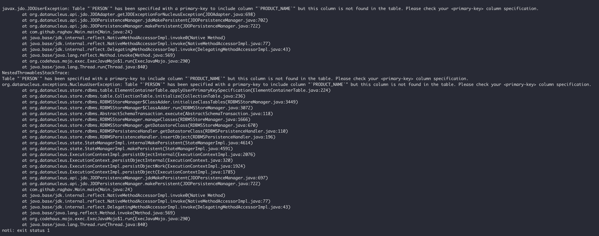
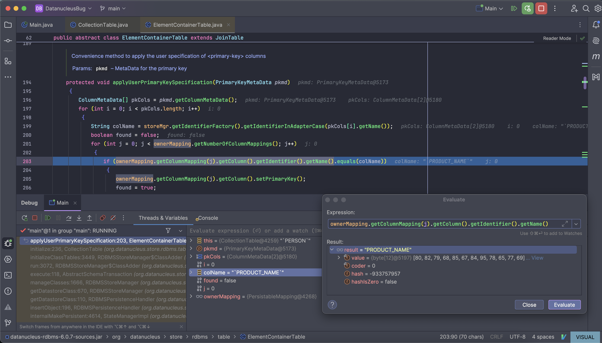
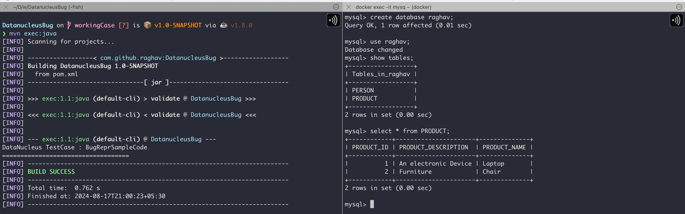

# To Build the project
```bash
mvn clean install
```

## To run the program
```bash
mvn exec:java
```

## For schema creation and deletion
```bash
mvn datanucleus:schema-create
mvn datanucleus:schema-delete
```

# NOTE
<p>
The same code is working with datanucleus version 5.x. Have created a separate branch named <em><strong>workingCase</strong></em> and attached the working screenshot as well

main branch: Java 17  
workingCase branch: Java 8
</p>

# Error StackTrace


# While Debugging



# Working Case with datanucleus 5.x

